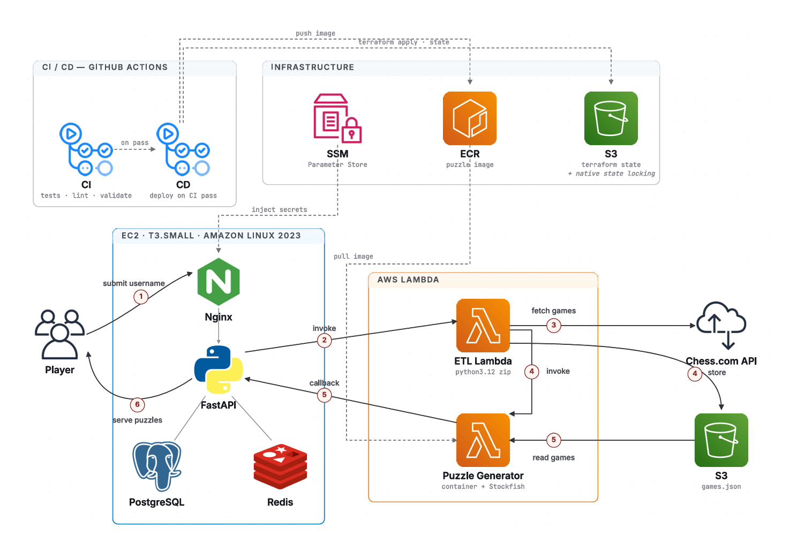
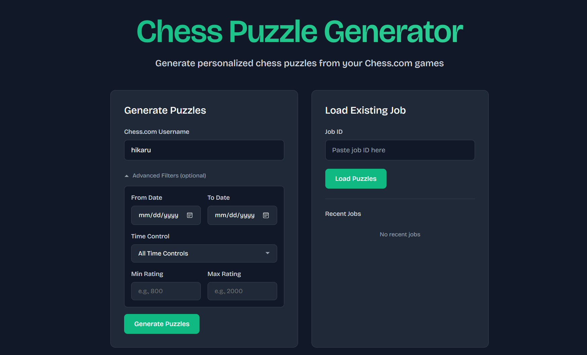
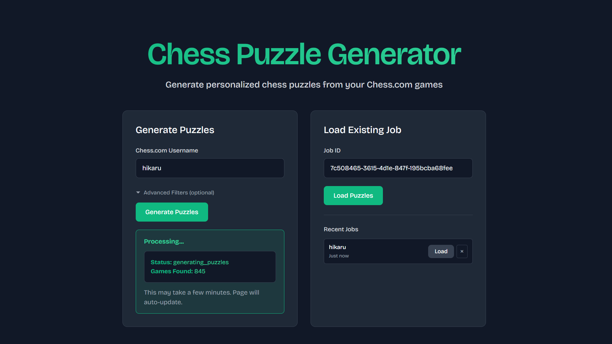
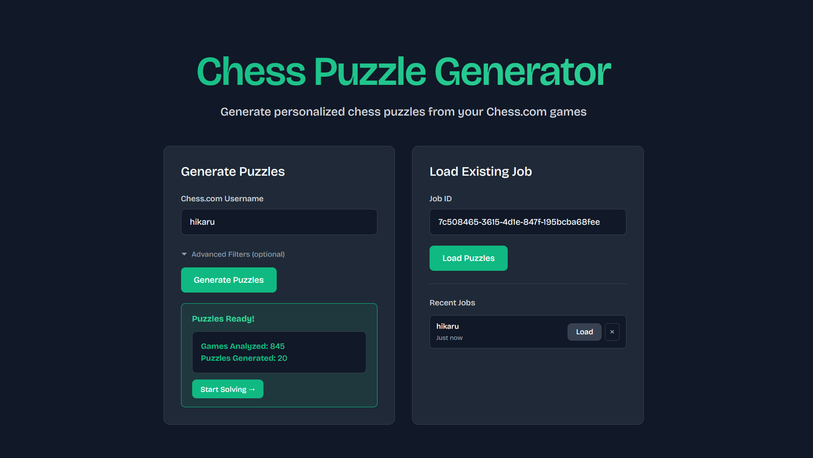
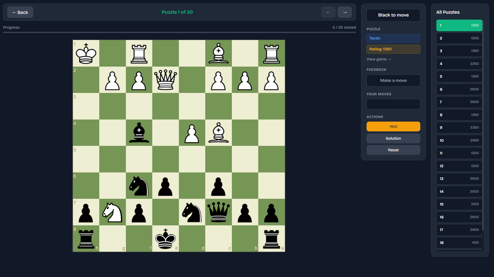

# End-to-End Platform Engineering of a Serverless ETL Pipeline for Chess Game Analysis and Puzzle Generation on AWS

A cloud-native platform that ingests Chess.com game archives, runs batch Stockfish analysis via AWS Lambda, and delivers personalised tactical puzzles through an interactive web UI - fully deployed on AWS with Terraform IaC and GitHub Actions CI/CD.

[](https://github.com/Data-Bishop/chess-puzzle-generator/actions/workflows/ci.yml)
[](https://github.com/Data-Bishop/chess-puzzle-generator/actions/workflows/deploy.yml)
[](LICENSE)

---

## Table of Contents

- [What This Project Demonstrates](#what-this-project-demonstrates)
- [Architecture](#architecture)
- [How It Works](#how-it-works)
- [Tech Stack](#tech-stack)
- [UI](#ui)
  - [Job Submission](#job-submission)
  - [Pipeline in Progress](#pipeline-in-progress)
  - [Puzzles Ready](#puzzles-ready)
  - [Puzzle Solver](#puzzle-solver)
- [Quick Start](#quick-start)
  - [Run Locally](#run-locally)
  - [Deploy to AWS](#deploy-to-aws)
- [Key Engineering Decisions](#key-engineering-decisions)
- [Cost Estimate](#cost-estimate)
- [Documentation](#documentation)
- [License](#license)

---

## What This Project Demonstrates

| Discipline | What was built |
|---|---|
| **Serverless ETL** | Two-stage AWS Lambda pipeline: game extraction (Python 3.12 zip) → Stockfish analysis (container image) |
| **Infrastructure as Code** | Full Terraform configuration - EC2, Lambda, S3, ECR, SSM, IAM, Elastic IP |
| **CI/CD** | GitHub Actions - tests on every push, automated deploy on CI pass via OIDC (no static keys) |
| **Containerisation** | Docker Compose stack (Nginx, FastAPI, PostgreSQL, Redis, Worker) for local parity with production |
| **Secrets management** | SSM Parameter Store injects secrets into EC2 at boot - zero manual configuration post-deploy |
| **Event-driven architecture** | Lambda → EC2 callback pattern; async job invocation with status polling |
| **Platform engineering** | Bootstrap pattern for one-time infra (state backend, OIDC provider, deploy role) separate from app infra |

---

## Architecture



---

## How It Works

1. **Player submits a Chess.com username** via the web UI. Nginx proxies the request to FastAPI, which creates a job record in PostgreSQL and returns a job ID immediately.
2. **FastAPI invokes the ETL Lambda** asynchronously via boto3. The job status updates to `processing`.
3. **ETL Lambda fetches game archives** from the Chess.com public API, filters them by the requested date range, time control, and rating, then stores the raw game data as `games.json` in S3.
4. **ETL Lambda invokes the Puzzle Generator Lambda**, passing the S3 object key. The job status updates to `generating_puzzles`.
5. **Puzzle Generator reads the games from S3**, parses each PGN with python-chess, and feeds every position to Stockfish. Positions where Stockfish finds a significant evaluation swing are extracted as tactical puzzles, each tagged with a theme (fork, pin, skewer, etc.) and a difficulty rating.
6. **Puzzle Generator callbacks to FastAPI** with the generated puzzles. FastAPI bulk-inserts them into PostgreSQL, sets the job status to `completed`, and the UI automatically loads the puzzle solver.

---

## Tech Stack

**Cloud & Infrastructure**


**Application**


---

## UI

### Job Submission

Enter a Chess.com username and optional filters - date range, time control, and rating range - to kick off the ETL pipeline.



### Pipeline in Progress

Once submitted, the UI polls job status in real time as it moves through the pipeline. Here Stockfish is analysing 845 games fetched from Chess.com.



### Puzzles Ready

When the pipeline completes, the results are summarised - games analysed, puzzles generated - with a direct link to start solving.



### Puzzle Solver

Solve puzzles on an interactive chessboard with move validation, tactic theme, difficulty rating, hint, and full solution reveal. Progress is tracked across all 20 puzzles.



---

## Quick Start

### Run Locally

No AWS account needed. The full pipeline runs inside Docker containers.

```bash
git clone https://github.com/Data-Bishop/chess-puzzle-generator.git
cd chess-puzzle-generator

cp .env.template .env        # default values work for local dev

docker compose up --build
```

Open **http://localhost** - the app is ready.

Full guide → [docs/local-setup.md](docs/local-setup.md)

---

### Deploy to AWS

One-time bootstrap, then every push to `main` deploys automatically.

```bash
# 1. Bootstrap - run once from your machine
cd bootstrap && terraform init && terraform apply

# 2. Add secrets to GitHub → Settings → Environments → production
#    (see cloud-setup.md for the full list)

# 3. Push to main - CI runs, then CD deploys everything
git push origin main
```

Full guide → [docs/cloud-setup.md](docs/cloud-setup.md)

---

## Key Engineering Decisions

| Decision | What was chosen | Why |
|---|---|---|
| **Two-stage Lambda pipeline** | ETL Lambda (zip) + Puzzle Generator Lambda (container) | Different runtime requirements - ETL is lightweight Python; Puzzle Generator needs Stockfish bundled in a container image and a 15-minute timeout for deep analysis |
| **S3 as inter-Lambda staging** | Games stored to S3, read by Puzzle Generator | Lambda has a 6 MB async payload limit; game archives can exceed this. S3 gives durability and allows the Puzzle Generator to retry reads independently |
| **EC2 over ECS / Fargate** | t3.small EC2 instance | A t3.small running 24/7 costs ~$15/month. Fargate for an always-on web server would cost 2–3× more for the same workload with added orchestration complexity |
| **SSM Parameter Store over env vars in code** | Secrets fetched at boot via SSM | Secrets are never in the codebase or Docker image. Rotating a secret requires only a new `terraform apply` - no rebuild or redeploy of the application |
| **OIDC over static AWS keys** | GitHub Actions assumes an IAM role via OIDC | No long-lived credentials stored anywhere. Tokens are scoped per-job and expire automatically, eliminating the risk of leaked access keys |
| **Bootstrap pattern** | Separate `bootstrap/` directory for one-time infra | Terraform needs an S3 bucket to store state, but it can't create that bucket using S3-backed state - a chicken-and-egg problem. Bootstrap is applied once locally; everything else is managed by CI/CD |
| **Docker Compose for local dev** | Same five services as production | Local and production environments are identical in behaviour. The only difference is `WORKER_MODE=local` (Docker worker) vs `WORKER_MODE=lambda` (AWS Lambda) |

---

## Cost Estimate

Running the full cloud stack in `eu-north-1` at moderate usage (~100 puzzle generation jobs/month).

| Resource | Details | Est. monthly cost |
|---|---|---|
| EC2 t3.small | $0.0216/hr × 730 hrs, always on | ~$15.77 |
| Elastic IP | Free when attached to a running instance | $0.00 |
| ETL Lambda | 100 inv × 512 MB × ~2 min = 6,000 GB-s | $0.00 ¹ |
| Puzzle Generator Lambda | 100 inv × 3 GB × ~8 min = 144,000 GB-s | $0.00 ¹ |
| ECR | ~1.5 GB image storage × $0.10/GB | ~$0.15 |
| S3 (games bucket) | Ephemeral objects, 1-day TTL | ~$0.01 |
| SSM Parameter Store | 3 standard parameters | $0.00 |
| **Total** | | **~$15.93/month** |

> ¹ Combined Lambda usage (~150,000 GB-seconds/month) stays well within the AWS free tier (400,000 GB-seconds + 1M requests/month free, permanently). Lambda costs only begin if usage exceeds ~267 jobs/month for the Puzzle Generator at 3 GB × 8 min per job.

---

## Documentation

| Document | Description |
|---|---|
| [Local Setup](docs/local-setup.md) | Run the full stack locally with Docker Compose |
| [Cloud Setup](docs/cloud-setup.md) | Deploy to AWS with Terraform and GitHub Actions |

---

## License

[MIT](LICENSE)
